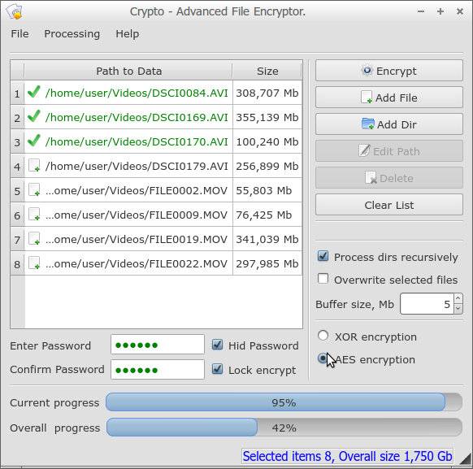
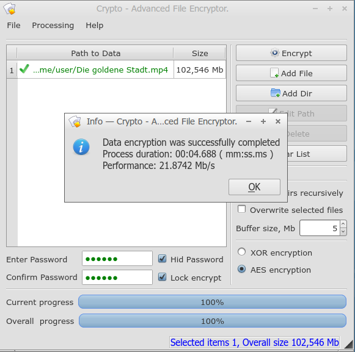

# Crypto - Advanced File Encryptor, based on one simple XOR and on a reliable AES encryption method

	
	
	
	
	
	

____

## Contents
* [About the Project](#About-the-Project)
* [Project folders](#Project-folders)
* [Main features](#Main-features)
* [Specification](#Specification)
* [System requirements](#System-requirements)
* [Compilation and installation](#Compilation-and-installation)
* [Further development](#Further-development)
* [License](#License)
____

## About the Project

TODO

____

## Project folders
TODO

____

## Main features
TODO

____

## Specification
TODO

____

## System requirements
TODO

____

## Compilation and installation
Here is a link to the installation program for Windows XP, Vista, 7, 8, 8.1 [crypto-setup.zip](https://github.com/SergejBre/crypto/releases/download/1.0.1.0/crypto-setup.zip)

____

## Further development
TODO

____

## License

